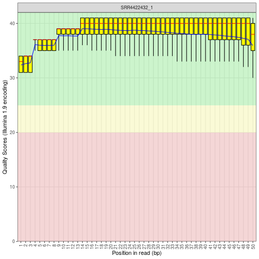
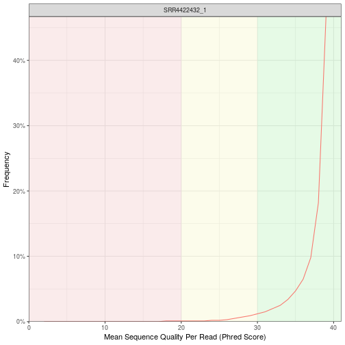
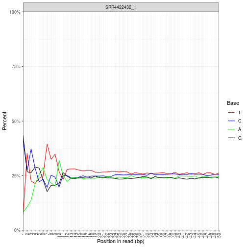
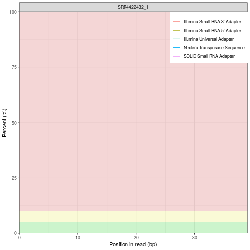
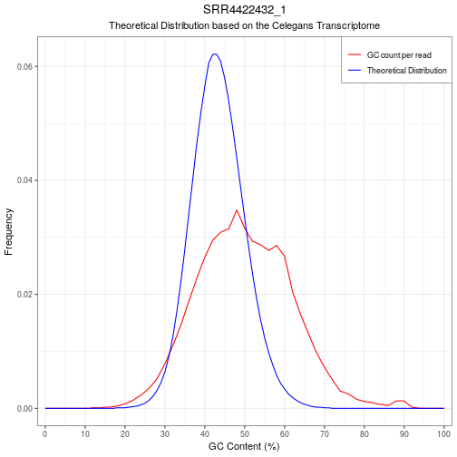

# test

test

```
## Loading required package: BiocGenerics
```

```
## Loading required package: parallel
```

```
## 
## Attaching package: 'BiocGenerics'
```

```
## The following objects are masked from 'package:parallel':
## 
##     clusterApply, clusterApplyLB, clusterCall, clusterEvalQ,
##     clusterExport, clusterMap, parApply, parCapply, parLapply,
##     parLapplyLB, parRapply, parSapply, parSapplyLB
```

```
## The following objects are masked from 'package:stats':
## 
##     IQR, mad, sd, var, xtabs
```

```
## The following objects are masked from 'package:base':
## 
##     anyDuplicated, append, as.data.frame, basename, cbind,
##     colnames, dirname, do.call, duplicated, eval, evalq, Filter,
##     Find, get, grep, grepl, intersect, is.unsorted, lapply, Map,
##     mapply, match, mget, order, paste, pmax, pmax.int, pmin,
##     pmin.int, Position, rank, rbind, Reduce, rownames, sapply,
##     setdiff, sort, table, tapply, union, unique, unsplit, which,
##     which.max, which.min
```

```
## Loading required package: ggplot2
```

```
## Loading required package: tibble
```

```
## % latex table generated in R 3.6.1 by xtable 1.8-4 package
## % Wed Aug  7 16:09:51 2019
## \begin{table}[ht]
## \centering
## \begin{tabular}{rll}
##   \hline
##  & Status & Category \\ 
##   \hline
## 1 & PASS & Basic Statistics \\ 
##   2 & PASS & Per base sequence quality \\ 
##   3 & FAIL & Per tile sequence quality \\ 
##   4 & PASS & Per sequence quality scores \\ 
##   5 & FAIL & Per base sequence content \\ 
##   6 & PASS & Per sequence GC content \\ 
##   7 & PASS & Per base N content \\ 
##   8 & PASS & Sequence Length Distribution \\ 
##   9 & FAIL & Sequence Duplication Levels \\ 
##   10 & WARN & Overrepresented sequences \\ 
##   11 & PASS & Adapter Content \\ 
##   12 & 39095879 & Total\_Sequences \\ 
##    \hline
## \end{tabular}
## \end{table}
```


